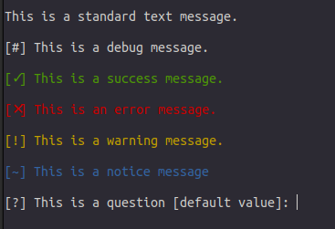

# cli-fragments
Awesome terminal input and output functions for Python 3.x scripts.

## Why this name?
I like to consider the command-line interface as if it were a graphical interface. In the development of graphical interfaces, 'components' are usually used to facilitate maintainability and design consistency. In my opinion, the word 'fragments' is a correct synonym to describe the same approach, but for command-line interfaces.

## Fragments
 - `error`: a red message having `[✕]` as prefix
 - `success`: a green message having `[✓]` as prefix
 - `warning`: a yellow message having `[!]` as prefix
 - `text`: a standard text in terminal having the proper padding
 - `debug`: a default color message having `[#]` as prefix
 - `notice`: a blue message having `[~]` as prefix
 - `ask`: a qustion to the user having `[?]` as prefix. The input value can be optionally validated passing a `validator` callback

 